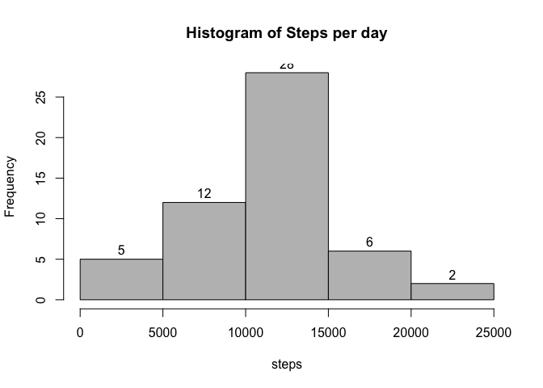
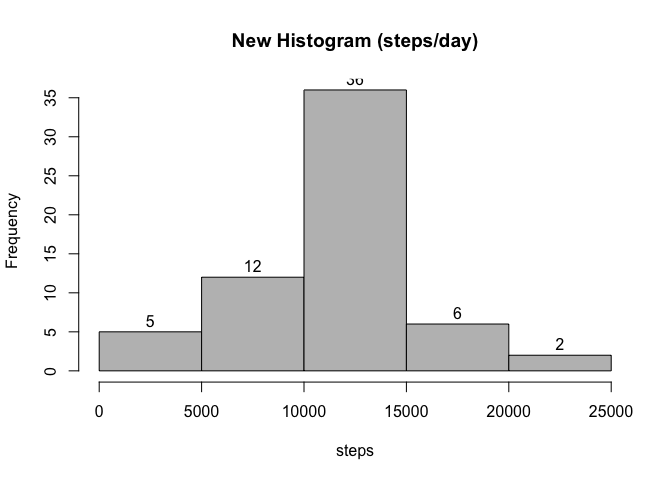
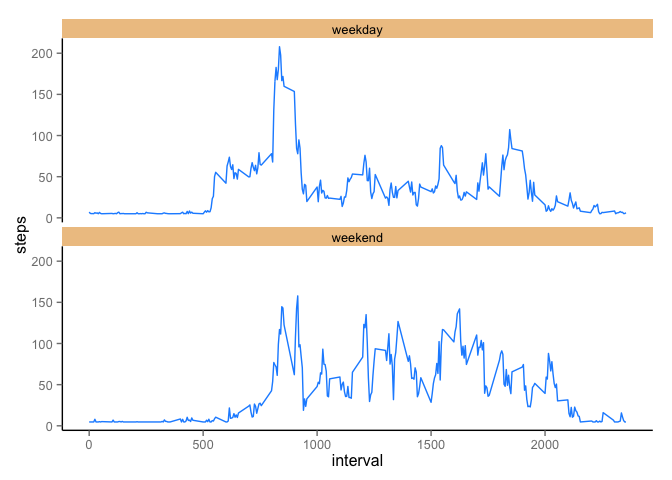

# Reproducible Research: Peer Assessment 1


## Loading and preprocessing the data
Show any code that is needed to

1. Load the data (i.e. read.csv())
2. Process/transform the data (if necessary) into a format suitable for your analysis

Here is the code to unzip, and load the file in a variable called "data"

```r
unzip("activity.zip")
data <- read.csv("activity.csv")
```

Transform the data dates to Date format

```r
data$date <- as.Date(data$date, "%Y-%m-%d")
```

## What is mean total number of steps taken per day?

For this part of the assignment, you can ignore the missing values in the dataset.


```r
clean.data <- na.omit(data)
```

1. Make a histogram of the total number of steps taken each day

First, create the subsets of the data by day,

```r
steps_day <- aggregate(steps ~ date, data=clean.data, FUN=sum)
```

Then call the hist function, to plot the generated data.

```r
hist(steps_day$steps, labels = TRUE, col="gray", main="Histogram of Steps per day", xlab="steps")
```

 

2. Calculate and report the mean and median total number of steps taken per day

This is the mean,

```r
mean(steps_day$steps)
```

```
## [1] 10766.19
```

This is the median,

```r
median(steps_day$steps)
```

```
## [1] 10765
```

## What is the average daily activity pattern?

1. Make a time series plot (i.e. type = "l") of the 5-minute interval (x-axis) and the average number of steps taken, averaged across all days (y-axis)

First, create the subsets of the data by interval,

```r
steps_interval <- aggregate(steps ~ interval, data=clean.data, FUN=mean)
```

Then call the plot function (type = "l"), to plot the generated data.

```r
plot(steps_interval$interval, steps_interval$steps, xlab="interval", ylab="steps", type="l")
```

 

2. Which 5-minute interval, on average across all the days in the dataset, contains the maximum number of steps?


```r
steps_interval$interval[which.max(steps_interval$steps)]
```

```
## [1] 835
```

## Imputing missing values

Note that there are a number of days/intervals where there are missing values (coded as NA). The presence of missing days may introduce bias into some calculations or summaries of the data.

1. Calculate and report the total number of missing values in the dataset (i.e. the total number of rows with NAs)


```r
length(which(is.na(data)))
```

```
## [1] 2304
```

2. Devise a strategy for filling in all of the missing values in the dataset. The strategy does not need to be sophisticated. For example, you could use the mean/median for that day, or the mean for that 5-minute interval, etc.

To fill the empty values, we will use the mean the cleaned data for that 5-minute interval.


```r
mean(clean.data$steps) #mean of data without na's
```

```
## [1] 37.3826
```

3. Create a new dataset that is equal to the original dataset but with the missing data filled in.


```r
new.data <- data
new.data$steps[is.na(new.data$steps)] <- mean(clean.data$steps)
```

4. Make a histogram of the total number of steps taken each day and Calculate and report the mean and median total number of steps taken per day. Do these values differ from the estimates from the first part of the assignment? What is the impact of imputing missing data on the estimates of the total daily number of steps?


```r
steps_day <- aggregate(steps ~ date, data=new.data, FUN=sum) #use new data
hist(steps_day$steps, labels = TRUE, col="gray", main="New Histogram (steps/day)", xlab="steps")
```

 

This is the new mean,

```r
mean(steps_day$steps)
```

```
## [1] 10766.19
```

This is the new median,

```r
median(steps_day$steps)
```

```
## [1] 10766.19
```

###### Histogram changed slightly, and the median increased only by a little.

## Are there differences in activity patterns between weekdays and weekends?

For this part the weekdays() function may be of some help here. Use the dataset with the filled-in missing values for this part.

1. Create a new factor variable in the dataset with two levels - "weekday" and "weekend" indicating whether a given date is a weekday or weekend day.


```r
new.data$day[weekdays(as.Date(new.data$date)) %in% c("Saturday", "Sunday")] <- "weekend"
new.data$day[!weekdays(as.Date(new.data$date)) %in% c("Saturday", "Sunday")] <- "weekday"
new.data[, 4] <- as.factor(new.data[, 4])
```

2. Make a panel plot containing a time series plot (i.e. type = "l") of the 5-minute interval (x-axis) and the average number of steps taken, averaged across all weekday days or weekend days (y-axis). See the README file in the GitHub repository to see an example of what this plot should look like using simulated data.

Aggregate the data by interval + day,

```r
new_step_data <- aggregate(steps ~ interval + day, data=new.data, FUN=mean)
```

I'm using ggplot this time, first load the library, 

```r
library(ggplot2)
```

Then you can plot,

```r
ggplot(new_step_data, aes(x=interval, y=steps, group=1)) + geom_line(colour="dodgerblue1") + facet_wrap(~ day, ncol=1) + theme(panel.grid.major = element_blank(), panel.grid.minor = element_blank(), 
    panel.background = element_blank(), axis.line = element_line(colour = "black"), strip.background = element_rect(fill="burlywood2"))
```

 
